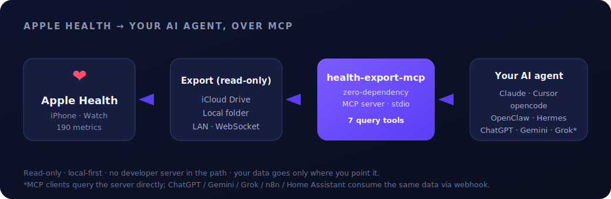
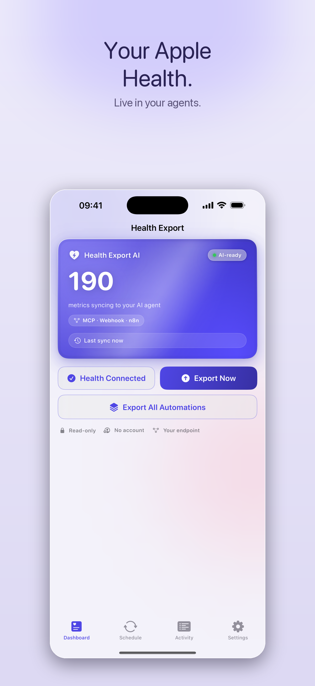
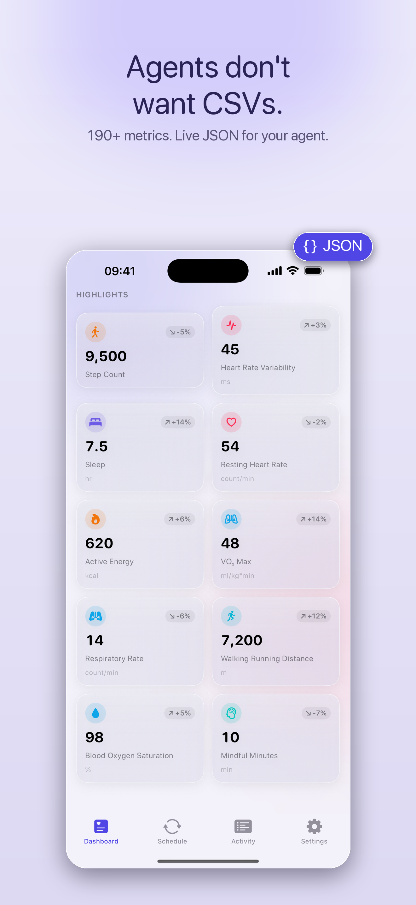
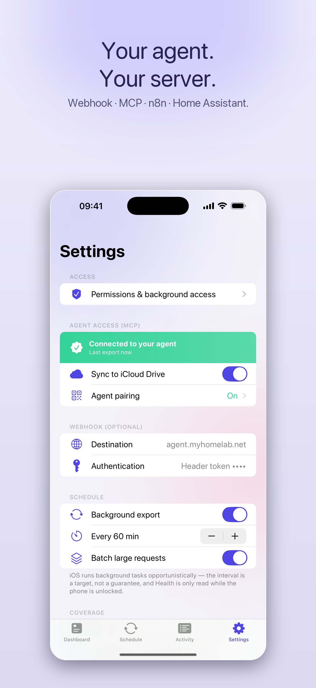

# health-export-mcp — Apple Health MCP server for AI agents

**Query your Apple Health data from Claude, ChatGPT, Cursor, OpenClaw, Hermes — and any other AI agent.**

`health-export-mcp` is an open-source, **zero-dependency** [Model Context Protocol (MCP)](https://modelcontextprotocol.io) server that lets any MCP-compatible AI agent query your **Apple Health / HealthKit** data — **190 metrics** as clean JSON — in plain language. Local-first, read-only, no accounts, and no developer server in the path. It's the open-source server for the [Health Export AI](https://www.healthexport.dev) iOS app.

<p align="center">
  
  
  
  
  
</p>

<p align="center">
  
</p>

> Ask your agent: *"Compare my HRV this week vs last week and tell me if I'm recovering."* — it calls the tools and answers from your **actual numbers**.

---

## What is health-export-mcp?

It's an MCP server that turns your Apple Health export into a tool your AI agent can query in natural language — HRV, sleep, resting heart rate, steps, workouts, VO₂ max, and 180+ more.

- **Who it's for:** anyone who wants their AI to reason over their *real* health data instead of a stale CSV.
- **What it isn't:** a cloud service. There's no developer server in the path — your data goes only where *you* point it.
- **Setup:** point the server at your exported data and add it to your AI client.

> **Try it with no iPhone needed:** `git clone https://github.com/PhilipAD/health-export-mcp.git && cd health-export-mcp && npm test` writes a 14-day sample cache and exercises every tool.

---

## Connect Apple Health to your AI agent — Quickstart

### 1. Get your Apple Health data flowing

The companion iOS app **[Health Export AI](https://www.healthexport.dev)** exports your Apple Health data — read-only, automatic, private. For this MCP server, export to a destination it can read:

| Destination | Notes |
|---|---|
| **iCloud Drive** (default) | Your Mac reads the synced folder automatically |
| **Local folder** | Any folder that syncs to your Mac (Dropbox, Google Drive, OneDrive, …) |
| **LAN** (HTTP / WebSocket) | Direct push to the server — great over Tailscale |

> Using a non-MCP tool (ChatGPT, n8n, Home Assistant)? The app can also POST to a **webhook** those tools read directly — see [Works with](#works-with-claude-cursor-chatgpt-openclaw-hermes).

### 2. Add the server to your agent

**Fastest — auto-configure:**

```bash
git clone https://github.com/PhilipAD/health-export-mcp.git
cd health-export-mcp
node apply-mcp-config.mjs     # detects installed clients and writes the config for you
```

**Manual — Claude Desktop** (`~/Library/Application Support/Claude/claude_desktop_config.json`):

```json
{
  "mcpServers": {
    "health-export": {
      "command": "node",
      "args": ["REPLACE_WITH_ABSOLUTE_PATH/server.mjs"],
      "env": { "HEALTH_DATA_DIR": "~/Library/Mobile Documents/iCloud~ai~healthexport~app/Documents" }
    }
  }
}
```

> Get the absolute path to paste above: `node -e "console.log(process.cwd()+'/server.mjs')"` (run inside the repo).
> Or skip JSON entirely — drag **`health-export.mcpb`** into **Claude Desktop → Settings → Extensions**.

**Cursor / VS Code:** `node gen-deeplinks.mjs` prints one-click install links.
**opencode / OpenClaw / Hermes:** see **[AGENTS.md](AGENTS.md)** for the exact block — same shape, one per client.

### 3. Ask your agent

Restart the client and try:

> *"Use health-export: what's my average HRV this week vs last week?"*

---

## Works with Claude, Cursor, ChatGPT, OpenClaw, Hermes

| Client / Agent | Integration | How |
|---|---|---|
| **Claude Desktop** | Native MCP | `.mcpb` bundle, or `mcpServers` block |
| **Cursor** | Native MCP | One-click deeplink, or `~/.cursor/mcp.json` |
| **opencode** | Native MCP | `opencode.json` `mcp` block |
| **OpenClaw** | Native MCP | Add the server block to your MCP config |
| **Hermes** | Native MCP | Add the server block to your agent's MCP config |
| **VS Code** (Copilot / Continue) | Native MCP | One-click deeplink |
| **ChatGPT · Gemini · Grok** | Webhook* | Consume the app's webhook export |
| **n8n · Home Assistant** | Webhook* | Trigger automations on the exported JSON |

<sub>*MCP clients query this server directly over stdio. ChatGPT / Gemini / Grok / n8n / Home Assistant don't speak MCP — they consume the same Apple Health data via the iOS app's token-authenticated **webhook** export.</sub>

---

## The 7 MCP tools

| Tool | What it does |
|---|---|
| `get_mcp_status` | Health check — source, metric/workout counts, latest data date. **Call first.** |
| `list_metrics` | Every available metric with unit, day count, and date range. |
| `get_health_metrics` | Daily values for a metric (or all) over a date range + an aggregate (avg/sum/min/max/latest). |
| `get_trends` | Recent N-day window vs the prior N days — change, % change, direction. |
| `compare_periods` | A metric across two arbitrary date periods (A vs B). |
| `get_structured_export` | Clean JSON for chosen metrics/range — drop straight into context. |
| `query_health_data` | Natural-language convenience: *"average HRV last month"* → routed structured results. |

**Coverage:** 190 Apple Health metrics across activity, heart, HRV, mobility, respiratory, body, sleep, hearing, and nutrition — plus workouts.

---

## Example AI queries

```text
"What has my resting heart rate done over the last 30 days?"
"Compare my deep sleep this week vs last week."
"Is my VO₂ max trending up or down this quarter?"
"Give me a clean JSON export of HRV, RHR and sleep for the last 14 days."
"Correlate my step count with my sleep duration this month."
```

---

## The app that feeds it

<p align="center">
  
  &nbsp;&nbsp;
  
  &nbsp;&nbsp;
  
</p>

<p align="center"><sub><a href="https://www.healthexport.dev">Health Export AI</a> — exports your Apple Health to your agent, automatically.</sub></p>

---

## Privacy & security

- **Read-only.** The server only reads your exported data — it never touches HealthKit and never writes back.
- **Local-first.** It runs on your machine over stdio. There is **no developer server** in the path.
- **Optional pairing.** Set `PAIRING_SECRET` to the code the iOS app shows (Settings → Agent pairing) to gate access.
- **Auditable.** Zero dependencies and a few hundred lines of readable JavaScript — read every line.

---

## Requirements

- **Node.js ≥ 18** (`node -v`).
- A folder containing a `.health-cache.json` exported by [Health Export AI](https://www.healthexport.dev) — or run `npm test` to generate a sample one.
- An MCP-compatible client (Claude Desktop, Cursor, opencode, OpenClaw, Hermes, VS Code) — or any tool that can read the webhook export.

---

## FAQ

**How do I get my Apple Health data into Claude / ChatGPT / my AI agent?**
Install `health-export-mcp`, export your Apple Health data with the [Health Export AI](https://www.healthexport.dev) iOS app (to iCloud, a folder, or your LAN), then add the MCP server to your AI client. Your agent can then query your Apple Health metrics in natural language. (Non-MCP tools like ChatGPT read the app's webhook export instead.)

**Is my health data sent to a server?**
Not to us. The MCP server runs locally and reads only the export files or endpoints you configure — there's no developer server in the path. Where your iOS export is delivered (iCloud, your LAN, a webhook) is entirely your choice.

**Which agents are supported?**
Any MCP client — Claude Desktop, Cursor, opencode, OpenClaw, Hermes, VS Code — natively. ChatGPT, Gemini, Grok, n8n, and Home Assistant consume the same data via webhook.

**Do I need the iOS app?**
The app is the easiest way to get Apple Health data off your iPhone in the format this server reads. You can also point `HEALTH_DATA_DIR` at any folder containing a compatible `.health-cache.json`.

---

## Troubleshooting

- **"No metrics found"** — confirm `HEALTH_DATA_DIR` points at the folder containing `.health-cache.json`, and that the app has exported at least once. Run `get_mcp_status` to see the resolved source and latest date.
- **Server not visible in the client** — use an **absolute** path to `server.mjs`, ensure Node ≥18, and fully restart the client.
- **Locked data error** — the export file is protected until first unlock after reboot; unlock your device once.

---

## Run it locally

```bash
# Node ≥18, no install needed
HEALTH_DATA_DIR=~/Library/Mobile\ Documents/iCloud~ai~healthexport~app/Documents node server.mjs

# integration test — writes a 14-day sample cache and exercises every tool
npm test
```

stdio transport (newline-delimited JSON-RPC 2.0) — the universal MCP transport. Optionally set `HEALTH_LISTEN=1` to also accept LAN pushes from the iOS app in the same process (see [`receiver.mjs`](receiver.mjs)).

---

## How it works

The iOS app reads Apple Health (read-only) and writes a compact `.health-cache.json` to the destination you choose. This server reads that file and exposes the 7 tools above over MCP. No bridge, no Docker, no database — just a file and stdio.

```
Apple Health → Health Export AI (iOS) → .health-cache.json → health-export-mcp → MCP client → you
```

---

## Related

- **Companion iOS app:** [Health Export AI](https://www.healthexport.dev) — exports 190 Apple Health metrics to your agent, automatically.
- **Model Context Protocol:** [modelcontextprotocol.io](https://modelcontextprotocol.io)
- **Per-agent setup:** [AGENTS.md](AGENTS.md)

If this helps your setup, a ⭐ makes it easier for others to find.

## License

MIT — see [LICENSE](LICENSE). Contributions welcome.

---

<sub>Apple Health MCP server · export Apple Health to AI · HealthKit MCP server · query Apple Health with Claude / ChatGPT / Cursor · Model Context Protocol health server · Apple Health to LLM · HRV, sleep & heart rate for AI agents.</sub>
